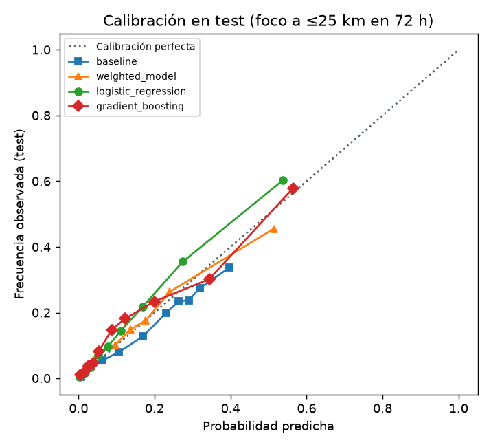

# Willay — Modelo de machine learning (v1.0.0)

> Estado: **fases 1–3 terminadas** (datos, variables, entrenamiento y evaluación), 2026-10-03.
> La app **sigue usando el modelo de pesos** (0,5 / 0,3 / 0,2). La integración en el backend (fase 4)
> está pendiente de aprobación. Código y pasos para reproducir: [`ml/README.md`](../ml/README.md).

## 1. Qué estima

La **probabilidad de que haya al menos un foco de calor VIIRS a 25 km o menos de la cabecera municipal en
las próximas 72 h** (días `d+1`, `d+2` y `d+3`), con lo que se sabe al final del día `d`.

Es un **indicador de riesgo, no una predicción exacta de incendios**. Un foco de calor no es un incendio
forestal confirmado (ver limitaciones).

## 2. Datos

| Fuente | Qué | Periodo | Notas |
|---|---|---|---|
| NASA FIRMS, VIIRS 375 m (SNPP + NOAA-20) | Focos de calor en el bbox de Nariño | 2014-12-02 a 2026-10-02 | Archivo estándar (SP) hasta 2026-06-30 y tiempo casi real (NRT) después. Son los mismos satélites que ingiere el backend. 16 099 focos desde 2019; se descartan 9 que FIRMS marca como fuente estática (ninguno aparece marcado como volcán). |
| NASA POWER, API diaria por punto (comunidad AG) | Clima diario de las 64 cabeceras | 2018-12-01 a 2026-09-30 | MERRA-2 (0,5° × 0,625°) y precipitación corregida con IMERG. Sin valores faltantes. |
| Tabla `fire_event` (scraping UNGRD + noticias) | Incendios reportados | 2019–2022 y 2026 | Solo se usa para recalcular el modelo de pesos actual. |
| Tabla `zone` | 64 municipios (DIVIPOLA, DANE) | — | Coordenadas de la cabecera municipal. |

### Cambio de fuente de clima: Open-Meteo → NASA POWER

El plan inicial usaba Open-Meteo (Historical Weather API, ERA5-Land de ~11 km, corregido por altura). Su
plan gratis cuenta **una llamada por ubicación y cada 14 días**: 64 zonas × 11 años son ~19 700 llamadas,
y el tope es 10 000 por día. La descarga, respetando ese tope, terminaba en unas 26 h. Se detuvo con lo
descargado (2023–2026) guardado en caché y se cambió a NASA POWER, que entrega todo el periodo de un punto
en una sola petición (64 peticiones en total, unos 2 minutos).

NASA POWER no publica un límite numérico: responde 429 ("Too Many Requests") y puede bloquear a quien pide
la misma ubicación muchas veces. El script hace una petición a la vez, con 1 s de pausa, reintentos con
espera creciente y caché por zona.

**Consecuencia:** la resolución es mucho más gruesa. Las 64 cabeceras caen en solo **10 celdas** de
MERRA-2, así que muchos municipios vecinos tienen exactamente el mismo clima, aunque estén a alturas muy
distintas (de la costa a 2500 m). Por eso el clima diferencia poco entre municipios (ver §5.3).

Como POWER se descargó desde 2019, el dataset empieza el **2019-01-01**. Los focos de 2015–2018 solo se usan
para la propensión de cada zona.

## 3. Dataset

Una fila por zona y día: **181 056 filas** (64 zonas × 2829 días, del 2019-01-01 al 2026-09-29). El último
día necesita 3 días de focos después.

| Radio | Positivos | % |
|---|---|---|
| 10 km | 7 703 | 4,25 % |
| **25 km** (el del modelo actual; etiqueta principal) | **29 078** | **16,06 %** |
| 50 km | 60 052 | 33,17 % |

- **Por año (25 km):** 2019 16,8 % · 2020 18,7 % · 2021 9,4 % · 2022 10,6 % · 2023 21,8 % · 2024 20,1 % ·
  2025 12,0 % · 2026 20,4 %.
- **Estacionalidad marcada:** septiembre 45 %, agosto 32 %, octubre 26 %; mayo 5 %, diciembre 6 %.
- **Por zona:** El Rosario 36 %, Taminango 35 %, Policarpa 32 %. La costa pacífica casi no tiene focos:
  Barbacoas, El Charco y Santa Bárbara 0,5 %.

## 4. Variables (25, sin fuga de información)

Todas usan solo días `<= d`. La prueba `ml/tests/test_features.py` reemplaza por números aleatorios todos
los datos posteriores a una fecha y comprueba que las variables hasta esa fecha no cambian.

- **Clima (17):** lluvia acumulada 1/3/7/14/30 días, días seguidos sin lluvia (< 1 mm), temperatura media,
  máxima, rango diario y tendencia (últimos 7 días − 7 anteriores), humedad del día y de 7 días, viento
  máximo y de 7 días, evapotranspiración, balance de agua de 30 días (lluvia − evapotranspiración) y
  humedad del suelo superficial.
- **Focos (5):** en la zona (≤ 25 km) el mismo día, en 7 y en 30 días; en el anillo de 25 a 50 km (los
  municipios vecinos) en 7 y en 30 días.
- **Estacionalidad (2):** día del año como seno y coseno.
- **Propensión (1):** días por año con un foco a ≤ 25 km en 2015–2018, antes de cualquier fila del dataset,
  así que no ve validación ni prueba.

Los incendios de la UNGRD **no** se usan como variable: solo cubren 2019–2022 (no hay datos en validación ni
prueba) y las noticias empiezan en 2026, así que la variable cambiaría de significado entre periodos.

## 5. Método y resultados

- **División temporal**, nunca aleatoria: entrenamiento 2019–2023 (116 864 filas, 15,4 % positivas),
  validación 2024 (23 424, 20,1 %), prueba 2025-01-01 a 2026-09-29 (40 768, 15,6 %). Es la división pedida;
  con datos desde 2019 el entrenamiento tiene 5 años.
- **Modelos:** (a) baseline = regresión logística con días sin lluvia + propensión; (b) el modelo de pesos
  actual, recalculado día a día con datos históricos equivalentes (`ml/willay_ml/weighted_model.py`, copia de
  `RiskScoringService.ts`); (c) regresión logística con las 25 variables; (d) `HistGradientBoostingClassifier`
  (`learning_rate` 0,05, 15 hojas, elegido por PR-AUC de validación).
- **Desbalance:** pesos de clase balanceados. **Calibración:** se ajusta solo con 2024 (Platt para los
  modelos lineales, isotónica para boosting y para el puntaje de pesos). El periodo de prueba se usa una
  sola vez.

### 5.1 Métricas en prueba (2025-01-01 a 2026-09-29)

| Modelo | ROC-AUC | PR-AUC | Brier | Precisión@5 | Recall@5 | Precisión@10 | Recall@10 |
|---|---|---|---|---|---|---|---|
| (a) Baseline (días sin lluvia + propensión) | 0,738 | 0,289 | 0,121 | **0,323** | 0,223 | 0,296 | 0,387 |
| (b) Modelo de pesos actual (calibrado) | 0,680 | 0,314 | 0,120 | 0,255 | 0,143 | 0,241 | 0,268 |
| (b) Modelo de pesos actual (puntaje/100) | 0,679 | 0,332 | 0,120 | 0,254 | 0,137 | 0,242 | 0,273 |
| **(c) Regresión logística** | **0,853** | **0,512** | **0,100** | 0,317 | 0,215 | **0,300** | 0,375 |
| (d) Gradient boosting | 0,822 | 0,474 | 0,104 | 0,308 | 0,194 | 0,287 | 0,343 |

Referencias:
- Tasa de positivos en prueba: 15,6 %. Es la PR-AUC y la precisión@k de un modelo al azar.
- Brier de predecir siempre esa tasa: 0,131.
- **Precisión@5** = de los 5 municipios que el modelo marca con más riesgo cada día, cuántos tuvieron focos en
  72 h (promedio por día). **Recall@5** = de los municipios con focos ese día, cuántos estaban en el top 5.

Calibración: la regresión logística y el boosting siguen bien la diagonal. La logística **subestima un
poco** entre 0,2 y 0,5: predice ~0,25 cuando se observa ~0,33.

### 5.2 Comparación con el modelo actual

**Sobre si hay focos en las próximas 72 h, la regresión logística supera claramente al modelo de pesos:**
- ROC-AUC 0,85 frente a 0,68.
- PR-AUC 0,51 frente a 0,33.
- Brier 0,100 frente a 0,120.
- Precisión@5: 32 % frente a 25 %.

Boosting no mejora a la regresión logística en ninguna métrica: con estos datos no compensa su complejidad.

**Pero ninguna variante gana al baseline simple en el ranking diario de municipios.** La precisión@5 queda
en 31–32 % para la logística, el boosting y el baseline. La ventaja de la logística está en **cuándo** sube
el riesgo (temporada, focos recientes en la zona y alrededor), no en **qué** municipios ordenar arriba cada
día. Ese orden lo domina la propensión histórica de la zona.

### 5.3 ¿Qué aporta cada grupo de variables? (ablación, regresión logística, prueba)

| Variables | ROC-AUC | PR-AUC | Precisión@5 |
|---|---|---|---|
| Todas | 0,853 | 0,512 | 0,317 |
| Sin clima | 0,843 | 0,494 | 0,317 |
| Sin focos recientes | 0,834 | 0,466 | 0,319 |
| Sin propensión | 0,838 | 0,497 | 0,286 |
| **Solo estacionalidad + propensión (3 variables)** | 0,828 | 0,503 | **0,322** |

**Conclusión honesta:** la mayor parte de la señal está en **dónde** (propensión de la zona) y **cuándo** (época
del año). El clima de NASA POWER aporta poco: +0,01 de ROC-AUC y +0,02 de PR-AUC. Encaja con su resolución
gruesa (10 celdas para 64 municipios). Los focos recientes aportan algo más (+0,05 de PR-AUC).

### 5.4 Importancia de variables

- **Gradient boosting** (caída de PR-AUC en prueba al permutar): propensión 0,092; focos del anillo en 30
  días 0,061; focos de la zona en 30 días 0,043; humedad del día 0,040; humedad de 7 días 0,027;
  estacionalidad 0,026 / 0,025; humedad del suelo 0,020; viento máximo 0,014.
- **Regresión logística** (coeficientes estandarizados): propensión +1,23; humedad del día −0,48; balance de
  agua de 30 días +0,41; humedad de 7 días −0,41; focos del anillo en 30 días +0,34; evapotranspiración
  +0,31; focos de la zona en 30 días +0,27.
  - Varias variables de lluvia están correlacionadas entre sí, así que sus signos individuales no se deben
    interpretar por separado.

### 5.5 Modelo guardado

`ml/models/metadata.json` guarda:
- versión 1.0.0;
- fecha de entrenamiento y commit;
- rangos de datos, variables y métricas;
- coeficientes e importancia de variables.

Los modelos entrenados (`*.joblib`) quedan fuera de git: se regeneran con `python -m willay_ml.train`. Para
la fase 4 se propone la **regresión logística exportada a JSON** (coeficientes + normalización +
calibración), implementada en TypeScript. Boosting no es mejor, así que ONNX no hace falta.

## 6. Limitaciones

- **Los focos de calor no son incendios forestales confirmados.** VIIRS detecta cualquier anomalía térmica:
  - quemas agrícolas y de potreros (muy comunes en Nariño en agosto y septiembre);
  - quemas de residuos y fuentes industriales.
  
  FIRMS solo marca como estáticas algunas fuentes conocidas. El modelo estima la **actividad de fuego**, no
  la ocurrencia de un incendio forestal.
- **Detección satelital incompleta.** Hay ~2–4 pasos diarios y las nubes ocultan focos (frecuentes en la
  costa pacífica y en los Andes). Un "0" puede ser "no se vio". Los incendios pequeños o bajo el dosel no se
  detectan.
- **Clima de reanálisis, no de estaciones, y muy grueso.** MERRA-2 tiene celdas de ~55 × 70 km: 10 celdas
  para 64 municipios. No representa bien la topografía andina (valles secos frente a páramo en la misma
  celda). Open-Meteo (~11 km) se descartó por tiempo, no por calidad.
- **Radio fijo desde la cabecera.** Se usan 25 km alrededor de un punto, no el polígono del municipio. Las
  zonas vecinas se solapan y un mismo foco puede contar para varios municipios.
- **La propensión domina.** El modelo aprende sobre todo qué municipios tienen focos todos los años y en qué
  meses. Avisará poco sobre un municipio con poca historia que de pronto tenga un evento extremo.
- **Cambio entre periodos.** La tasa de positivos varía entre años (9 % a 22 %, por El Niño y la llegada de
  NOAA-20 en 2018). La calibración con 2024, un año alto, puede no valer para años muy distintos.
- **Comparación con el modelo actual aproximada.** El backend usa el clima de la hora actual (Open-Meteo, viento
  a 10 m). La recreación histórica usa promedios diarios de POWER y el viento máximo a 2 m, así que las cifras
  de (b) son una aproximación al modelo actual, no su desempeño exacto en la app.
- **Lo de producción no es igual al entrenamiento.** En producción, el pronóstico y los focos NRT llegan con
  retraso y otra fuente. La fase 4 tendrá que calcular las mismas variables con el mismo significado, y tener
  un respaldo cuando falten datos.
- **Resultado: un indicador de riesgo, no una predicción exacta.**
